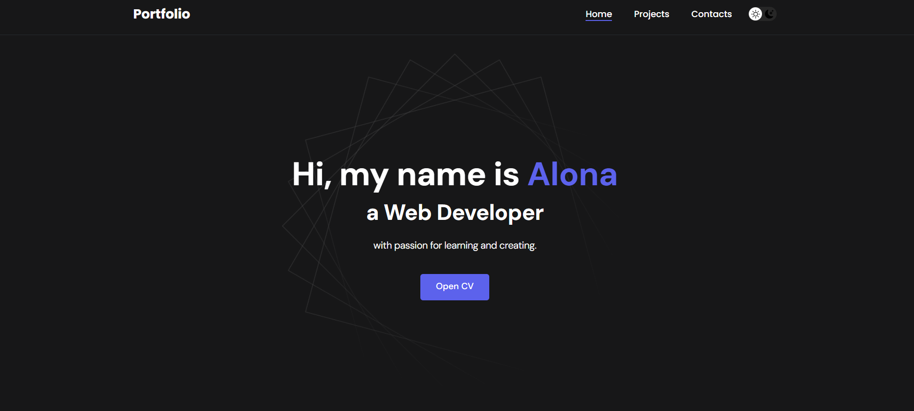
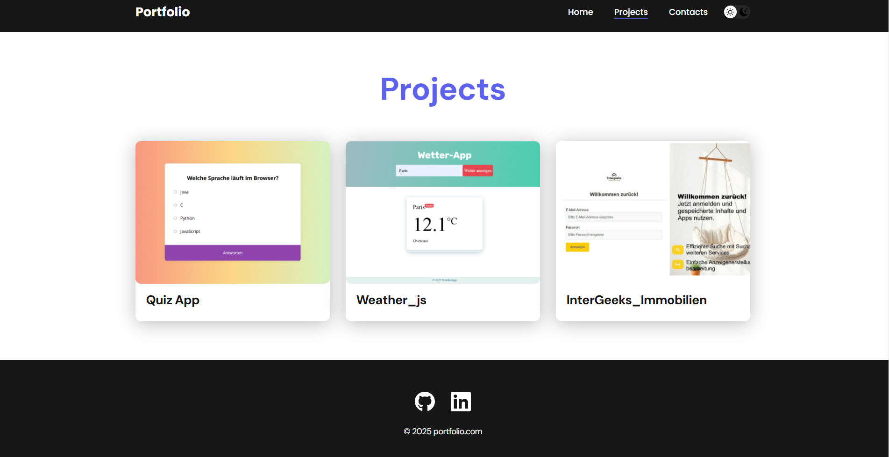
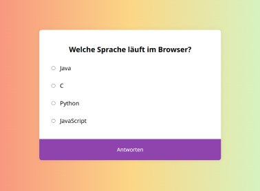
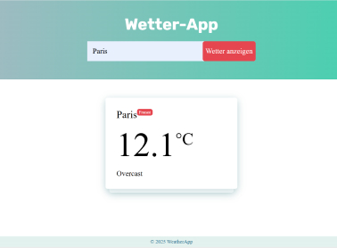
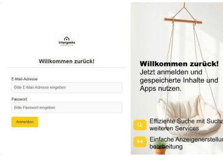

# 🌟 Portfolio React App

Mein persönliches Portfolio-Projekt, erstellt mit **React**.  
Hier findest du eine Übersicht meiner Fähigkeiten und Projekte.

  
  

---

## 🚀 Fähigkeiten

| Bereich  | Technologien                         |
| -------- | ---------------------------------- |
| Frontend | JavaScript, ReactJS, HTML, CSS|
| Backend  |  MySQL, PHP        |
| Testing  | Cypress, Git                       |

---

## 💼 Projekte

### 1. Quiz App  
  
**Skills:** HTML, CSS, JavaScript  
🔗 [GitHub Repo](https://github.com/altkachenko11/quiz-projekt-js)

---

### 2. Weather_js  
  
**Skills:** JavaScript  
🔗 [GitHub Repo](https://github.com/altkachenko11)

---

### 3. InterGeeks Immobilien  
  
**Skills:** HTML, CSS, JavaScript, PHP, MySQL  
🔗 [GitHub Repo](https://github.com/)

📬 Kontakt
Alona Tkachenko
Email: altkachenko11@icloud.com
GitHub: altkachenko11

